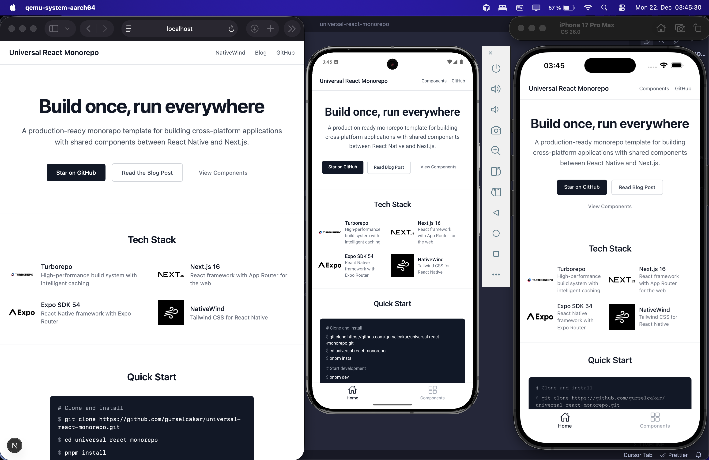

# Universal React Monorepo

Build React components once, run on web, iOS, and Android. A Turborepo + NativeWind monorepo template with shared UI.



> **New to monorepos?** Follow the [step-by-step guide](https://www.gurselcakar.com/monorepo) that built this template.

## Getting Started

**Prerequisites:** Node.js 18+, pnpm 10+, and optionally Xcode/Android Studio for mobile.

```bash
git clone https://github.com/gurselcakar/universal-react-monorepo.git
cd universal-react-monorepo
pnpm install
pnpm dev              # Start all apps
```

Run individually:

```bash
pnpm --filter web dev       # Next.js → localhost:3000
pnpm --filter web-vite dev  # Vite → localhost:5173
pnpm --filter mobile dev    # Expo Metro bundler
```

Other commands: `pnpm build`, `pnpm lint`, `pnpm typecheck`

## Tech Stack

| Layer | Technology |
|-------|------------|
| Web | Next.js 16 or Vite + TanStack Router |
| Mobile | Expo SDK 56 (React Native) |
| Shared UI | React Native + NativeWind |
| Build | Turborepo, pnpm workspaces, TypeScript |

Components in `packages/ui/` are written once with React Native + NativeWind. On web, `react-native-web` renders them as HTML. On mobile, Expo renders them natively.

## Project Structure

```
├── apps/
│   ├── mobile/     # Expo React Native app
│   ├── web/        # Next.js web app
│   └── web-vite/   # Vite web app (alternative)
├── packages/
│   └── ui/         # Shared component library
└── turbo.json      # Turborepo config
```

### Choosing a Web Framework

Both `web` (Next.js) and `web-vite` (Vite + TanStack Router) are included. Remove the one you don't need:

**Keep Next.js only:**
```bash
rm -rf apps/web-vite
pnpm install
```

**Keep Vite only:**
```bash
rm -rf apps/web
mv apps/web-vite apps/web
# Update "name" in apps/web/package.json from "web-vite" to "web"
pnpm install
```

## NativeWind v5 + Tailwind v4

This repo runs **NativeWind v5 (preview)** with **Tailwind CSS v4**. Key differences from v4/v3:

### CSS config (no more `tailwind.config.js`)

Tailwind v4 moves all configuration into CSS. `tailwind.config.js` is deleted. Theme tokens live in a `@theme {}` block inside the CSS entry file (e.g. `global.css`):

```css
@import "tailwindcss/theme.css" layer(theme);
@import "tailwindcss/preflight.css" layer(base);
@import "tailwindcss/utilities.css";
@import "nativewind/theme";

@theme {
  --color-primary: hsl(var(--primary));
  --font-sans: Inter-Regular, system-ui, sans-serif;
  /* ... */
}
```

### PostCSS / Vite

- **Mobile (Metro):** `postcss.config.mjs` with `@tailwindcss/postcss`
- **Next.js:** `postcss.config.js` with `@tailwindcss/postcss`
- **Vite:** `@tailwindcss/vite` plugin in `vite.config.ts` (no postcss needed)

### Third-party component API

`remapProps` and `cssInterop` (v4) are replaced by a single `styled` function from `nativewind` (re-exported from `react-native-css`):

```ts
// v4 — removed
import { remapProps, cssInterop } from 'nativewind';
remapProps(Component, { className: 'style' });
cssInterop(Component, { className: 'style' });

// v5 — use this
import { styled } from 'nativewind';
styled(Component, { className: { target: 'style' } });

// With nativeStyleToProp (e.g. SVG components)
styled(Circle, {
  className: { target: 'style', nativeStyleToProp: { fill: true, stroke: true } },
});
```

### TypeScript env file

`nativewind-env.d.ts` now references `react-native-css/types` instead of `nativewind/types`:

```ts
/// <reference types="react-native-css/types" />
```

### `lightningcss` pin

The root `package.json` pins `lightningcss` to `1.30.1` via `pnpm.overrides` to prevent Metro deserialization errors with `global.css`.

## MaskedView — Web Implementation

`packages/ui/src/MaskedView.web.tsx` is the web shim for `@react-native-masked-view/masked-view`.

### How it works

`mix-blend-mode: destination-in` is unreliable across browsers due to compositing-context issues. The web implementation uses the proper browser masking API instead:

1. **Render** `maskElement` into a hidden off-screen div (outer wrapper at `left: -100000`, inner `ref` div at normal position so `html-to-image` clones it correctly)
2. **Rasterize** the inner div to a PNG data URL with `html-to-image` (`toPng`, 2× pixel ratio)
3. **Apply** the PNG as `mask-image` / `-webkit-mask-image` on the content layer

```tsx
// The mask's alpha channel controls visibility:
// opaque pixels → content visible
// transparent pixels → content hidden
<MaskedView
  style={{ width: 200, height: 80 }}
  maskElement={
    <div style={{
      width: 200, height: 80,
      background: 'linear-gradient(to right, black 40%, transparent 100%)',
    }} />
  }
>
  <div style={{ width: 200, height: 80, background: 'linear-gradient(135deg, #6366f1, #ec4899)' }} />
</MaskedView>
```

> **Important:** mask element children must use explicit **pixel dimensions** (not `100%`) to resolve correctly inside `position: absolute` containers.

### Dependency

`html-to-image` is added to `packages/ui` for the rasterization step.

---

## Keyboard Handling Patterns (Native)

Based on [betomoedano/keyboard-guide](https://github.com/betomoedano/keyboard-guide). The mobile app already ships `react-native-keyboard-controller` + `KeyboardProvider` (wired in `apps/mobile/app/_layout.tsx`). Prefer these patterns in order:

### 1. Worklet "fake view" spacer — chat-style screens (best)

Do **not** pad or translate the container. Render an empty `Animated.View` below the input whose height tracks the keyboard frame-by-frame on the UI thread:

```tsx
import { useKeyboardHandler } from 'react-native-keyboard-controller';
import Animated, { useAnimatedStyle, useSharedValue } from 'react-native-reanimated';

const PADDING_BOTTOM = 20;

const useGradualAnimation = () => {
  const height = useSharedValue(PADDING_BOTTOM);
  useKeyboardHandler(
    {
      onMove: (e) => {
        'worklet';
        height.value = Math.max(e.height, PADDING_BOTTOM);
      },
      onEnd: (e) => {
        'worklet';
        height.value = e.height;
      },
    },
    [],
  );
  return { height };
};

// Screen:
const { height } = useGradualAnimation();
const fakeView = useAnimatedStyle(() => ({ height: Math.abs(height.value) }), []);

<FlatList inverted keyboardDismissMode="on-drag" ... />
<TextInput ... />
<Animated.View style={fakeView} />  {/* keyboard-synced spacer */}
```

Zero stutter — `onMove` worklets fire every frame of the keyboard animation. Use `inverted` lists so newest content stays pinned to the input.

### 2. Large / paragraph inputs (multiline) — flex resize pattern

For inputs holding paragraphs of text, make the **input itself flex** so it shrinks as the keyboard spacer grows. The flex column redistributes space automatically:

```tsx
<View style={{ flex: 1, padding: 16 }}>
  <TextInput
    multiline
    numberOfLines={8}
    maxLength={280}
    textAlignVertical="top"   // Android: anchor text to top, not center
    style={{
      flex: 1,                 // ← input fills + shrinks with available space
      padding: 16,
      borderRadius: 16,
      marginBottom: 16,
    }}
  />

  {/* fixed-height footer content stays visible above keyboard */}
  <View style={{ flexDirection: 'row', gap: 16 }}>...</View>

  <Animated.View style={keyboardPadding} />  {/* same fake-view spacer */}
</View>

<KeyboardToolbar
  content={<Text>Custom toolbar content</Text>}
  showArrows={false}
  doneText="Close keyboard"
/>
```

Key points:
- **`flex: 1` on the multiline `TextInput`** — when the spacer grows, the input shrinks instead of being pushed off-screen
- **`textAlignVertical="top"`** — required on Android or paragraph text floats to vertical center
- **`maxLength`** caps runaway content; `numberOfLines` sets the initial visual height
- Toggle helper: `Keyboard.isVisible() ? Keyboard.dismiss() : inputRef.current?.focus()`

### 3. Multi-field forms — `KeyboardAwareScrollView` + `KeyboardToolbar`

```tsx
import { KeyboardAwareScrollView, KeyboardToolbar } from 'react-native-keyboard-controller';

<KeyboardAwareScrollView bottomOffset={62} style={{ flex: 1, marginBottom: 62 }}>
  {/* many TextInputs */}
</KeyboardAwareScrollView>
<KeyboardToolbar />   {/* prev / next / done navigation for free */}
```

Auto-scrolls the focused input above the keyboard. `bottomOffset` must reserve the toolbar height.

### 4. Fallback — RN core `KeyboardAvoidingView` (avoid if possible)

```tsx
<KeyboardAvoidingView
  style={{ flex: 1 }}
  behavior={Platform.OS === 'ios' ? 'padding' : undefined}  // Android: let windowSoftInputMode handle it
>
  <FlatList keyboardDismissMode="on-drag" keyboardShouldPersistTaps="always" />
  <TextInput ... />
</KeyboardAvoidingView>
```

Only reacts to discrete show/hide events → visible stutter. Use patterns 1–3 instead.

### Existing usages to keep consistent

`apps/mobile/src/stickers/ui/StickerPickerSheet.tsx`, `apps/mobile/src/ticket/ui/TicketActionsBar.tsx`, `apps/mobile/src/stories-editor/components/text/TextEditor.tsx`.

---

## Routing with Solito

`solito` v5 is available in `@dvnt/ui` and provides a unified routing API for Next.js (web) and Expo Router (native).

### Current Setup
- **Web**: Next.js App Router (`next/link`, `next/navigation`)
- **Mobile**: Expo Router (`expo-router`)

### Solito Import Paths

| Platform | Import Path | Usage |
|----------|-------------|-------|
| **Web (Next.js)** | `next/link` | Use Next.js Link directly |
| **Native (Expo Router)** | `solito` | `Link`, `useRouter`, hooks |
| **All** | `solito` | `useRouter`, `useParams`, `useSearchParams`, `createParam` |

### Solito Pattern

Solito v5 wraps Expo Router for native. For web, use Next.js hooks directly:

```tsx
// Native component (Expo Router via Solito)
import { Link, useRouter, useParams } from 'solito';

function EventDetail() {
  const router = useRouter();
  const { id } = useParams();           // Route params (/events/[id])
  
  return (
    <View>
      <Text>Event {id}</Text>
      <Link href="/events">Back to events</Link>
      <Button onPress={() => router.push(`/events/${id}/edit`)}>
        Edit
      </Button>
    </View>
  );
}
```

```tsx
// Web component (Next.js App Router)
import Link from 'next/link';
import { useRouter } from 'next/navigation';

function EventDetail() {
  const router = useRouter();
  
  return (
    <div>
      <Link href="/events">Back to events</Link>
      <Button onClick={() => router.push(`/events/${id}/edit`)}>
        Edit
      </Button>
    </div>
  );
}
```

### Key APIs

| Solito | Web (Next.js) | Native (Expo Router) |
|--------|---------------|----------------------|
| `useRouter()` | `next/navigation` | `expo-router` |
| `useParams()` | `useParams()` | `useLocalSearchParams()` |
| `useSearchParams()` | `useSearchParams()` | `useGlobalSearchParams()` |
| `Link` | `next/link` | `expo-router/link` |
| `usePathname()` | `usePathname()` | `usePathname()` |

### Route Param Types (Solito v5)

```tsx
// Define typed params for a route
import { createParam } from 'solito';

const { useParam } = createParam<{ id: string; tab?: string }>();

function TabScreen() {
  const [id] = useParam('id');        // string | undefined
  const [tab] = useParam('tab');      // string | undefined
}
```

### Linking Configuration

Solito provides `linkTo` and `getLinkingConfig` for deep-linking that works on both platforms:

```tsx
import { getLinkingConfig } from 'solito';

// In your root layout or navigation container
const linking = getLinkingConfig({
  prefixes: ['https://dvnt.app', 'dvnt://'],
  config: {
    screens: {
      home: '',
      events: 'events',
      'events/[id]': 'events/:id',
    },
  },
});
```

### Migration Path

1. **New shared components**: Use Solito imports
2. **Existing platform-specific pages**: Keep using Next.js / Expo Router directly
3. **Gradual adoption**: Replace cross-platform hooks with Solito versions as you touch files

See [solito.dev](https://solito.dev/app-directory/overview) for full App Directory docs.

---

## TanStack Showcase (`/tanstack`)

`apps/web/src/app/tanstack/page.tsx` demonstrates four TanStack packages on a shared 500-row ticket dataset:

| Package | Demo |
|---|---|
| `@tanstack/react-table` | Sortable + globally-filterable inventory table with progress bars |
| `@tanstack/react-virtual` | 500-row list windowed to only visible DOM nodes |
| `@tanstack/react-form` | `useForm` + `form.Field` + `form.Subscribe` with live preview |
| `@tanstack/react-pacer` | `useDebouncedCallback` (400 ms) and `useThrottledCallback` (300 ms / 80 ms mouse) with an event log |

### List virtualization convention

- **Web:** `@tanstack/react-virtual` (`useVirtualizer`) — DOM-native windowing
- **Native:** `@legendapp/list` (Legend List) — RN-native high-performance list

Pick per platform; do not use Legend List for web-only virtualized views or react-virtual on native.

### Semantic HTML

Web pages use top-tier semantic markup (the web equivalent of `@expo/html-elements`, which is native-only in `apps/mobile`):

- `<section aria-label>` + `<header>` per showcase block, `<article>` for cards
- `<search>` + labelled `type="search"` inputs, `<output>` for computed values
- `<table>` with `<caption>`, `scope="col"`, and `aria-sort` on sortable headers
- `<form>` with `<fieldset>`/`<legend>`, every input labelled via `htmlFor`/`id`
- `<nav aria-label="Breadcrumb">` with `aria-current="page"`
- `role="list"`/`role="listitem"` on virtualized rows (valid with absolute-positioned sizer)
- `<output aria-live="polite">` + `<ul>`/`<time>` for the event log

## Next.js SSR — react-native-web Hydration Fix

`apps/web/src/app/registry.tsx` exports `RNWStyleRegistry`, which flushes react-native-web's atomic CSS into the SSR HTML via `useServerInsertedHTML`. Without this, RNW generates different class names on the server vs. client, causing React hydration mismatches.

```tsx
// apps/web/src/app/registry.tsx
'use client'
import { useServerInsertedHTML } from 'next/navigation'
import { useRef } from 'react'
import { StyleSheet } from 'react-native'

export function RNWStyleRegistry({ children }: { children: React.ReactNode }) {
  const isServerInserted = useRef(false)
  useServerInsertedHTML(() => {
    if (isServerInserted.current) return
    isServerInserted.current = true
    const sheet = StyleSheet.getSheet()
    return <style dangerouslySetInnerHTML={{ __html: sheet.textContent }} id={sheet.id} />
  })
  return <>{children}</>
}
```

`RNWStyleRegistry` wraps `ImageProvider`/`ApiProvider` in `apps/web/src/app/layout.tsx`. The `useRef` guard prevents the [Next.js double-invocation bug](https://github.com/vercel/next.js/issues/49354) from inserting duplicate style tags.

## Author

Built by [Gürsel Çakar](https://x.com/gurselcakar). Check out my games: [Hukora](https://hukora.com) and [Arithmego](https://arithmego.com).
